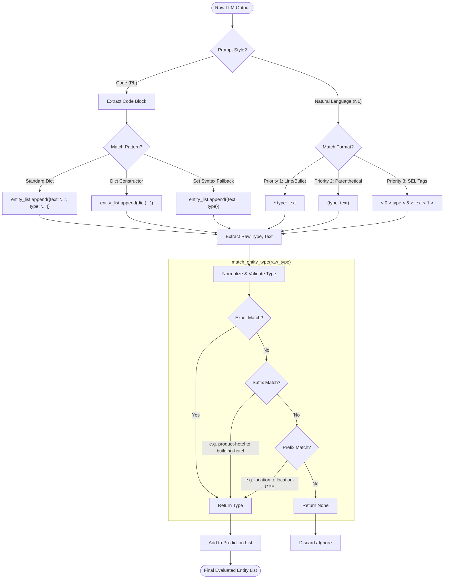

# CodeIE Output Parsing & Evaluation Workflow

This document illustrates how raw outputs from the LLM are parsed into structured entity lists for evaluation against ground truth.

## Parsing Workflow Diagram



## Example Scenario

### Input (Code Style)
```python
def extract_entities(text):
    entity_list = []
    # Model hallucinates a specific subtype 'product-weapon'
    entity_list.append({"text": "B-52", "type": "product-weapon"}) 
```

### Parsing Steps
1. **Style Check**: Detected `PL` (Code).
2. **Regex Extraction**: Matches standard dictionary pattern.
   - Raw Type: `product-weapon`
   - Raw Text: `B-52`
3. **Normalization (`match_entity_type`)**:
   - **Exact Match?** Is `product-weapon` in `[product-airplane, product-car, ...]`? **No**.
   - **Suffix Match?** Does it end with valid suffix? 
     - Checks `product-airplane` vs `weapon`. No match.
   - **Prefix Match?** Does it start with valid prefix?
     - `product-weapon` starts with `product-`?
     - Found `product-airplane`? No.
     - *Detailed Issue*: The fallback logic tries to match the *base category* if strict matching fails. If `product-weapon` isn't in the schema, and only `product-other` exists:
       - If the schema has `product-other`, `product-weapon` might NOT match `product-other` automatically unless explicitly handled or if `product` is a valid type itself.
   - **Result**: If `product-weapon` is not in schema, it returns `None` (or valid type if mapping exists).

### Common Failure Points (Based on recent logs)
1. **Zero F1**: The raw type (e.g., `product-weapon`) implies a correct category, but isn't in the allowed schema. If normalization fails to map it to `product-other`, it is discarded or counted as a False Positive (if treated as a valid but wrong class) vs False Negative (missed gold entity).
2. **Empty Prediction**: Code syntax errors (e.g. `entity_list.append({"Item", "Type"})`) where regex fails to identify text vs type.
